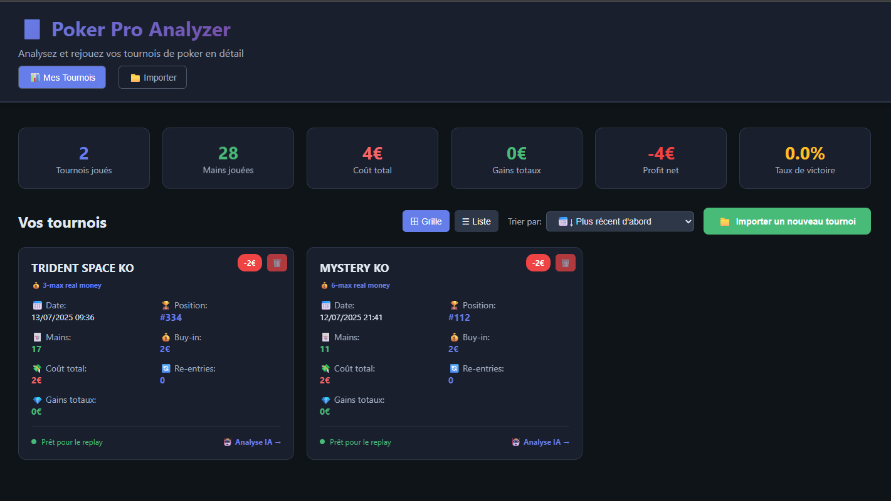
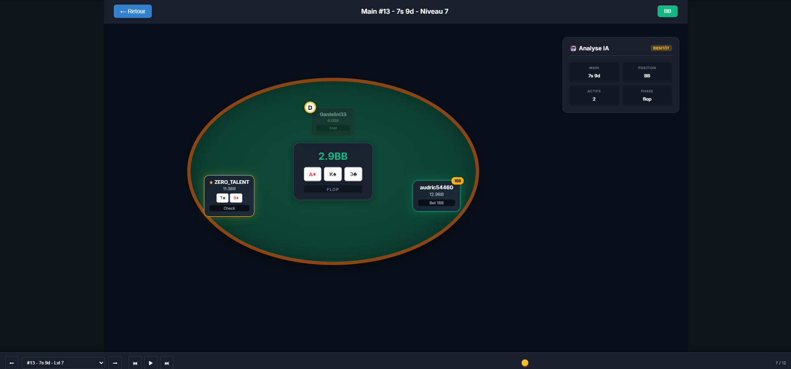

# 🃏 Poker Pro Analyzer

**Poker Pro Analyzer** est une application web et API qui vous permet d'importer, analyser et rejouer vos tournois Winamax, main par main, en vue d'une analyse IA de vos plays !  
Le but : savoir **si vous avez bien joué chaque coup** grâce au parsing et (bientôt) au feedback automatisé.

---

## 🎯 Aperçu de l’interface




## 🚀 Fonctionnalités principales

- **Import facile de tournois Winamax** (`.txt` mains + summary)
- **Parsing automatique** des logs et extraction complète des mains
- **Replay visuel** : revivez chaque main et chaque action comme sur la vraie table
- **Gestion multi-tournois** : stats perso, tri, suppression
- **Interface moderne & responsive** (React + TypeScript)
- **API REST (FastAPI/Python)** pour parser, stocker et gérer les tournois
- **Analyse IA des plays (à venir)** : recevez des suggestions sur chaque move

---

## 🐳 Déploiement rapide avec Docker Compose

### 1️⃣ Prérequis
- [Docker](https://www.docker.com/) et [Docker Compose](https://docs.docker.com/compose/install/) installés sur votre machine

### 2️⃣ Installation et lancement (build automatique inclus)
```bash
git clone https://github.com/ton_github/poker-pro-analyzer.git
cd poker-pro-analyzer
docker compose up --build
```
> **Astuce :** La première fois, le build est obligatoire.  
> Par la suite, pour relancer sans recompiler, utilisez simplement :
> ```bash
> docker compose ups
> ```

### 3️⃣ Accès à l’application

- **Frontend (interface utilisateur) :** [http://localhost:3000](http://localhost:3000)
- **Backend API (FastAPI) :** [http://localhost:8000](http://localhost:8000)

---

#### 📁 Volumes et persistance des données

- Les tournois et fichiers importés sont stockés dans le dossier partagé `/data` sur votre machine (`./data`).
- Les changements dans le code sont automatiquement pris en compte grâce aux montages de volumes (hot reload).

#### 🛑 Autres commandes utiles

```bash
docker compose logs         
docker compose restart      
docker compose down -v      
```

---

## 👨‍💻 Installation classique (optionnelle, sans Docker)

### Backend (FastAPI/Python)

```bash
cd backend
python -m venv venv
source venv/bin/activate
pip install -r requirements.txt
uvicorn main:app --reload
```
API accessible sur `http://localhost:8000`.

### Frontend (React/TypeScript)

```bash
cd frontend
npm install
npm start
```
Interface utilisateur sur `http://localhost:3000`.

---

## 🎲 Utilisation

### Importer un tournoi Winamax

1. Cliquez sur "**Importer un tournoi**" dans l’interface.
2. Glissez/déposez :
   - Le fichier **mains** :  
     ex. `20250708_TRIDENT_SPACE_KO_real_holdem_no-limit.txt`
   - Le fichier **summary** :  
     ex. `20250708_TRIDENT_SPACE_KO_summary.txt`
3. L’analyse commence automatiquement et vous accédez au replay détaillé.

### Jouer le replay

- Parcourez chaque main et chaque action pas à pas.
- **À venir** : Recevez des feedbacks IA sur vos décisions ("Bien joué", "Erreur", "À revoir") avec explication.

### Gérer vos tournois

- Tri, suppression, statistiques avancées sur tous vos tournois.
- Visualisez votre profit, nombre de mains jouées, re-entries, winrate, etc.

---

## 📂 Dossier Winamax — Où trouver vos fichiers ?

- Par défaut sur Windows :  
  `C:\Users\USERNAME\Documents\Winamax\History`
- Fichier de mains : `NOM_TOURNOI.txt`
- Fichier summary : `NOM_TOURNOI_summary.txt`

---

## 🛡️ Sécurité

- Toutes vos données restent sur VOTRE ordinateur.
- Aucun upload vers des serveurs externes.

---

## 📑 Endpoints API (pour développeurs)

- `POST /api/tournaments/upload` — Upload main file (.txt)
- `POST /api/tournaments/{id}/update-summary` — Upload summary file (.txt)
- `GET /api/tournaments` — Liste des tournois
- `GET /api/tournaments/{id}/hands` — Liste des mains d’un tournoi
- `DELETE /api/tournaments/{id}` — Supprime le tournoi (et ses mains)

---

## 💡 Roadmap à venir

- [x] Import & parsing Winamax `.txt`
- [x] Replay main par main, stats et gestion tournoi
- [ ] Ajout de l’**analyse IA "play review"** coup par coup
- [ ] Feedback stratégique et conseils intégrés
- [ ] Export/replay partageable, historique enrichi

---

## 📝 Licence

MIT

---

🎁 **Poker Pro Analyzer — Devenez meilleur… main par main !**

---

*(Feel free to adapt ce README selon ton Github, mettre tes contacts, ou ajouter des captures d’écran !)*